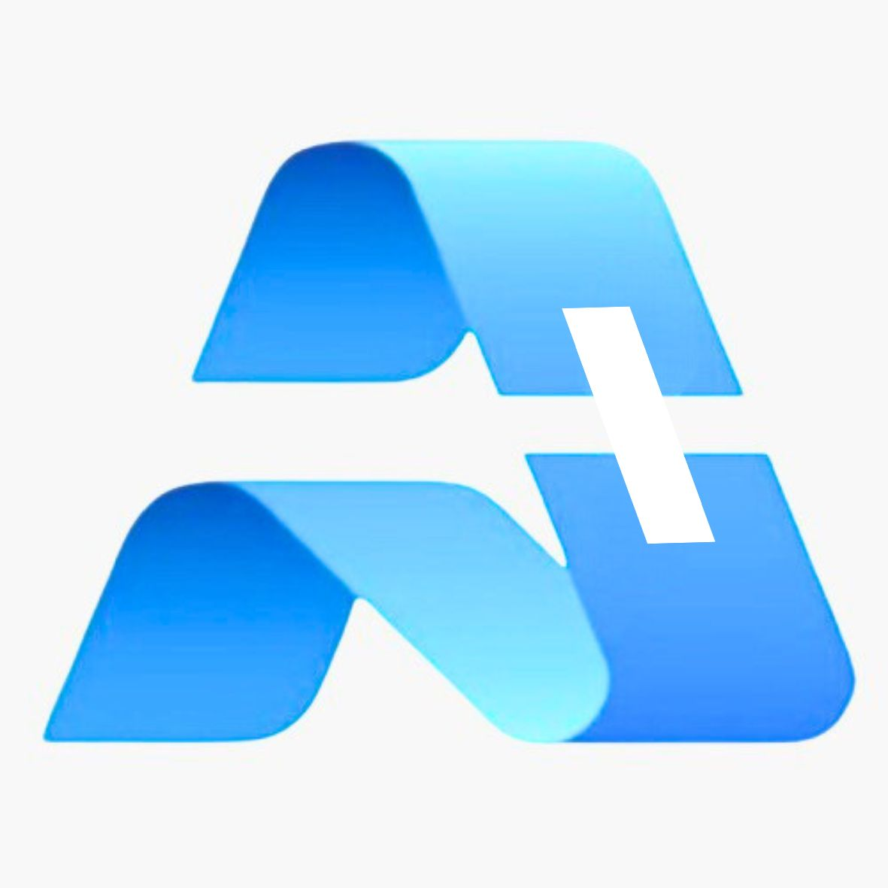

# A+ Group Website



Website institucional para o Grupo A+, um ecossistema de inovação que atua nas áreas de construção civil, arquitetura, engenharia, banco de investimentos, impacto social e inteligência estratégica.

## Sobre o Projeto

Este projeto foi desenvolvido utilizando Next.js e TailwindCSS, seguindo as diretrizes de design e identidade visual do Grupo A+. O site apresenta as seguintes seções:

- **Home**: Apresentação da empresa com frase manifesto e CTAs principais
- **Quem Somos**: História, missão, visão, valores e equipe
- **Projetos**: Portfólio de empreendimentos como Jardim Guanabara e Vila A+
- **Investidores**: Modelo de negócio, simulador e FAQ
- **Blog**: Artigos sobre inovação, construção e sustentabilidade
- **Contato**: Formulário, mapa e integração com WhatsApp

## Paleta de Cores

A paleta de cores foi desenvolvida com base na identidade visual da logo A+:

- **Azul Marinho Escuro** (`#101C2C`): Fundo principal
- **Azul Meia-noite** (`#0B131F`): Fundo secundário
- **Dourado Fosco** (`#C9A76D`): Acentos e destaques
- **Branco Off-white** (`#F7F7F7`): Texto principal
- **Azul Acinzentado** (`#8899AA`): Texto secundário

## Estrutura do Projeto

```
a-plus-website/
├── public/
│   └── images/
│       ├── a-plus-logo.jpg
│       └── ...
├── src/
│   ├── app/
│   │   ├── page.tsx
│   │   ├── layout.tsx
│   │   ├── blog/
│   │   └── projetos/
│   └── components/
│       ├── Header.tsx
│       └── Footer.tsx
└── ...
```

## Tecnologias Utilizadas

- **Next.js**: Framework React para renderização do lado do servidor
- **TailwindCSS**: Framework CSS para estilização
- **TypeScript**: Linguagem de programação tipada
- **React**: Biblioteca JavaScript para construção de interfaces

## Desenvolvimento

Para executar o projeto localmente:

```bash
# Instalar dependências
npm install

# Iniciar servidor de desenvolvimento
npm run dev
```

O site estará disponível em `http://localhost:3000`.
